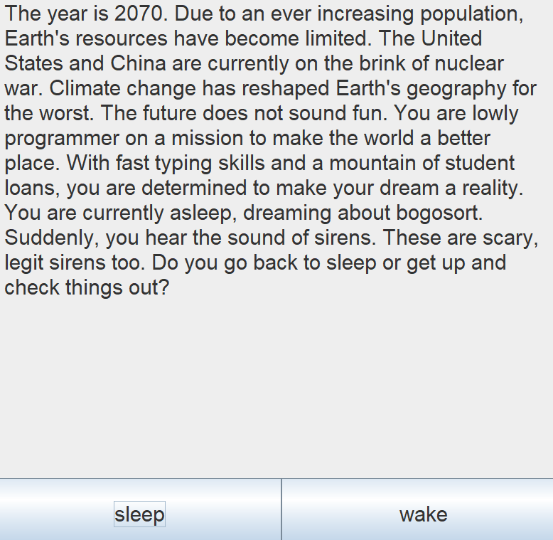

# Goofy Text Adventure Game
Hello! This a project I worked on awhile back and it's essentially a text based adventure game. The goal of this 
assignment was to get us familiarized with binary trees and further develop our programming skills. The rules of the
game are simple: after reading the prompt, select which option you think is best. This will continue until you reach
the end of the game or you die in a crazy circumstance.
## User Interface
Here is a screenshot showing what to expect when running the application. Clicking one of the two buttons below the
text will take you to another prompt. 

## To Run
    java GoofyTextAdventure